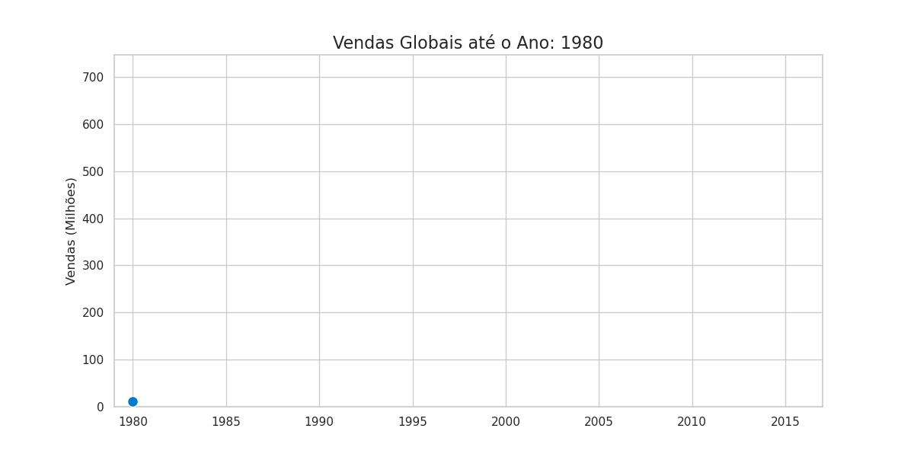
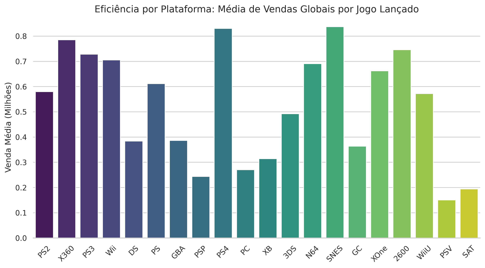
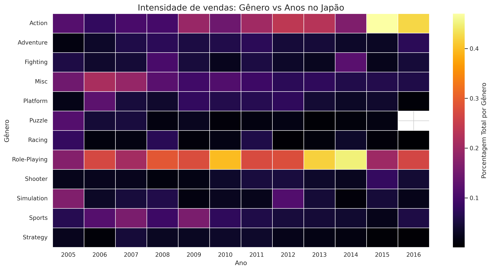
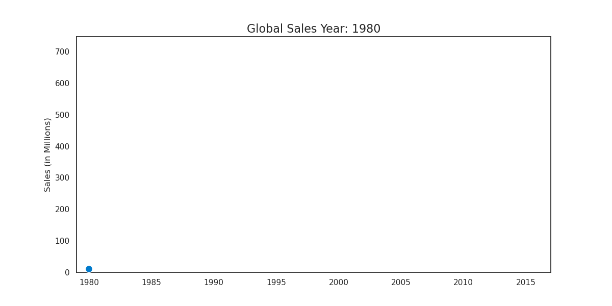

# 🎮 Video Game Sales: Análise Exploratória Orientado a Neǵocios

[Read in English](#english)

Nota: Esta página apresenta apenas os principais insights e visualizações do estudo.
A análise completa, incluindo todo o processo estatístico, tratamento de dados, visualizações adicionais e interpretações detalhadas, pode ser consultada nos notebooks disponíveis neste repositório ou diretamente no [Google Colab](https://colab.research.google.com/drive/1Ds48b7uqd7GIC3Kfwy_OD2yoizm-R6Qf?usp=sharing).

## Visão Geral
Este conjunto de dados contém informações sobre as vendas de video games em diferentes plataformas, gêneros e regiões, sendo extremamente valioso para diversas análises estatísticas e casos de uso em negócios.

Colunas:

    Rank – Ranking de vendas globais.

    Name – Nome do jogo.

    Platform – Plataforma de lançamento do jogo (ex: PC, PS4, Xbox).

    Year – Ano de lançamento do jogo.

    Genre – Gênero do jogo.

    Publisher – Empresa publicadora (editora) do jogo.

    NA_Sales – Vendas na América do Norte (em milhões de unidades).

    EU_Sales – Vendas na Europa (em milhões de unidades).

    JP_Sales – Vendas no Japão (em milhões de unidades).

    Other_Sales – Vendas no restante do mundo (em milhões de unidades).

    Global_Sales – Total de vendas mundiais acumuladas.

## Objetivo

Este projeto realiza uma análise exploratória de dados (EDA) sobre vendas globais de videogames, com foco em extração de insights orientados a negócio, análise de eficiência histórica por plataforma e diferenças regionais de mercado (Mercado Global, América do Norte, Europa, Japão e Outras Regiões).

O trabalho foi desenvolvido como parte do meu processo de aprimoramento técnico em análise de dados, combinando estatística descritiva, visualização avançada e interpretação estratégica dos resultados.

## Ferramentas
* **Python (Pandas & NumPy):** Utilizados para manipulação eficiente de grandes volumes de dados, incluindo limpeza, tratamento de valores ausentes, normalização, criação de métricas derivadas, visualização de outliers e operações de agregação.

* **Estatística Descritiva** Aplicação de tabelas de frequência, medidas de tendência central e medidas de dispersão para compreensão aprofundada da distribuição dos dados e identificação de padrões relevantes.

* **Seaborn & Matplotlib:** Empregados para visualizações analíticas e estatísticas, com uso de diferentes tipos de gráficos conforme o objetivo da análise, incluindo histogramas, gráficos de barras, linhas, heatmaps, boxplots e polar charts.

* **Plotly:** Utilizado para criação de visualizações interativas e dinâmicas, permitindo melhor exploração temporal, comparação entre categorias e comunicação visual de insights.

* **KaggleHub:** Integração via API para garantir a reprodutibilidade direta da fonte de dados mais atualizada.

---

## Pontos Chave da Análise

### 1. Dinâmica Temporal e Animação de Vendas
O gráfico animado no topo do projeto revela o "boom" da sétima geração de consoles. 
* **Aspecto Técnico:** Manipulação de eixos temporais e criação de visualizações interativas que facilitam a compreensão de tendências de longo prazo por stakeholders não técnicos.

### 2. Eficiência de Plataforma (Market Intelligence)

Identificamos que plataformas com alto volume de vendas (ex: DS, PC) possuem uma **fragmentação de receita** maior. Plataformas da Sony (PS2/PS3) demonstraram uma eficiência por título superior, indicando um ecossistema mais saudável para grandes lançamentos (AAA).
* **Apecto Técnico:** Cálculo de KPIs personalizados (Revenue per Title) e análise de market share.
### 3. Preferência dos Gêneros em cada Região

Identificamos as principais tendências, evolução e regressão dos principais gêneros consumidos em cada região do mundo, além de suas particularidades pertinentes ao mercado local.
* **Aspecto Técnico:** Análise comparativa multirregional e visualização matricial de dados categóricos.
---

## Estrutura do Repositório
* `notebooks/`: Versões [PT-BR] e [EN-US] detalhadamente comentadas.
* `img/`: Assets visuais e gráficos exportados para apresentações.
* `environment.yml`: Configuração completa do ambiente Conda para execução imediata (Zero Setup Error).

---

# English

# 🎮 Video Game Sales: Business-Oriented Exploratory Analysis

Note: This page presents only the primary insights and visualizations of the study. The full analysis, including the complete statistical process, data cleaning, additional visualizations, and detailed interpretations, can be found in the notebooks available in this repository or directly via [Google Colab](https://colab.research.google.com/drive/19bsao2OeZWmSPIPz8BRQn_aR44Qtizmd?usp=sharing).

## Overview

This dataset contains information on video game sales across different platforms, genres, and regions, making it extremely valuable for various statistical analyses and business use cases.

Columns:

    Rank – Global sales ranking.

    Name – The game's name.

    Platform – Release platform (e.g., PC, PS4, Xbox).

    Year – Release year.

    Genre – Game genre.

    Publisher – The game's publishing company.

    NA_Sales – Sales in North America (in millions of units).

    EU_Sales – Sales in Europe (in millions of units).

    JP_Sales – Sales in Japan (in millions of units).

    Other_Sales – Sales in the rest of the world (in millions of units).

    Global_Sales – Total accumulated worldwide sales.

## Objective

This project performs an Exploratory Data Analysis (EDA) on global video game sales, focusing on extracting business-oriented insights, historical efficiency analysis per platform, and regional market differences (Global Market, North America, Europe, Japan, and Other Regions).

This work was developed as part of my technical advancement in data analysis, combining descriptive statistics, advanced visualization, and strategic interpretation of the results.
Tools

* **Python (Pandas & NumPy):** Used for efficient manipulation of large data volumes, including cleaning, missing value treatment, normalization, creation of derived metrics, outlier visualization, and aggregation operations.

* **Descriptive Statistics:** Application of frequency tables, measures of central tendency, and measures of dispersion for a deep understanding of data distribution and identification of relevant patterns.

* **Seaborn & Matplotlib:** Employed for analytical and statistical visualizations, using different chart types based on the analysis objective, including histograms, bar charts, line charts, heatmaps, boxplots, and polar charts.

* **Plotly:** Used to create interactive and dynamic visualizations, allowing for better temporal exploration, category comparison, and visual communication of insights.

* **KaggleHub:** API integration to ensure direct reproducibility from the most up-to-date data source.

## Analysis Key Points
### 1. Temporal Dynamics and Sales Animation

The animated chart at the top of the project reveals the "boom" of the seventh console generation.

* **Technical Aspect:** Manipulation of temporal axes and creation of interactive visualizations that facilitate the understanding of long-term trends for non-technical stakeholders.

### 2. Platform Efficiency (Market Intelligence)

We identified that platforms with high sales volume (e.g., DS, PC) possess greater revenue fragmentation. Sony platforms (PS2/PS3) demonstrated superior efficiency per title, indicating a healthier ecosystem for major AAA releases.

* **Technical Aspect:** Calculation of custom KPIs (Revenue per Title) and market share analysis.

### 3. Regional Genre Preferences

We identified the main trends, evolution, and regression of the primary genres consumed in each region of the world, along with their specificities pertaining to the local market.

* **Technical Aspect:** Multi-regional comparative analysis and matrix visualization of categorical data.

## Repository Structure

* `notebooks/`: [PT-BR] and [EN-US] versions, detailed with comments.
* `img/`: Visual assets and charts exported for presentations.
* `environment.yml`: ull Conda environment configuration for immediate execution (Zero Setup Error).
